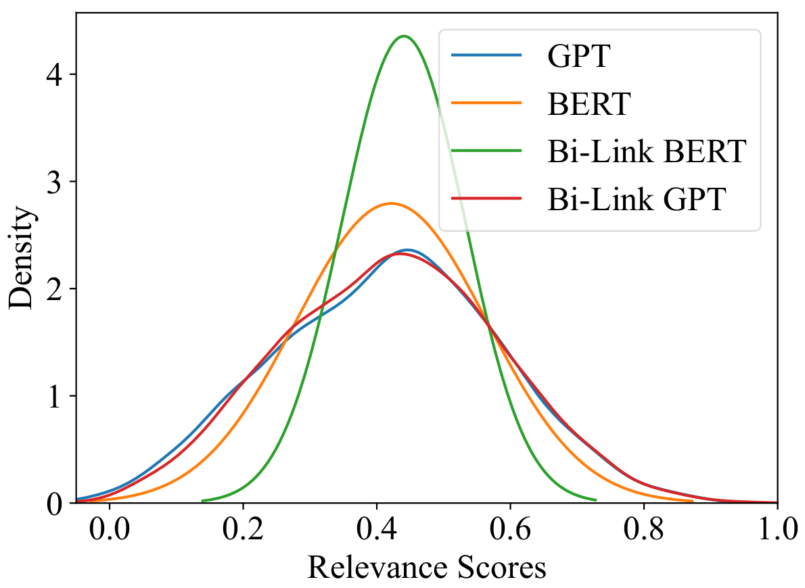

# Bunting: Efficient Token Sparsification Through the Lens of Infused Knowledge
The code for Bi-Stage Prefix Tuning framework will be updated in this repo. 
The novelty of this paper is that text-based KG reasoning can be speeded up with Bi-Stage Prefix Tuning using **the same LLM (either a BERT or GPT)**. To measure semantic transferability, we develop an **Antiphrasis Evaluation Protocol** where understanding of novel relations is measured by performance drop. Hence, down is up! Welcome to check our implementation and predictive examples for more details.
<figure>

    <figcaption style="text-align: center">Fig. 1 Bi-stage Prefix-Tuning of KG reasoning.</figcaption>
</figure>

## Download all files within the repo
```bash
unzip all_files.zip -d DESTINATION
```

## Data Preparation
Extract knowledge graphs to the data folder similar as follows:
```python
wiki5m_ind
├── train.txt
├── valid.txt
├── test.txt
├── wikidata5m_entity.txt
├── wikidata5m_relation.txt
└── wikidata5m_text.txt 
```

## Prepare Environment
pip install -r requirement.txt

## Data Preprocessing
```bash
bash scripts/preprocess.sh WN18RR
```

## Checkpoints
| Dataset                 | Checkpoints                                                          |
|-------------------------|----------------------------------------------------------------------|
| WN18RR Bunting BERT     | [Checkpoint](https://mega.nz/file/1W0yVLTY#1zOuDVhYyplCvZp5AOQTGey7dCiSqA0FnKepPmVGupg)|
| WN18RR Bunting GPT | [Checkpoint](https://mega.nz/file/hDl3WQiI#CBq1lBYwyZmrePArG_XWjAuJ1DWZ8tpDNRm_2TcqUYg)|
| Wikidata5M-transductive | [Checkpoint](https://mega.nz/folder/ob8mXYoL#1YXiUlX8RI7NZdrAnvypdA) |

```bash
mv ${CHECKPOINT_BI-LINK_WN18RR} checkpoint/bilink_bert
```
## Evaluation
To evaluate the model, please run
```bash
bash scripts/eval.sh ${CHECKPOINT} WN18RR
```
Please chage pretrained-model from bert-base-uncased to gpt-2 when evaluating Bunting GPT

## Model Comparison
<figure>

    <figcaption style="text-align: center">Fig. 3 Comparison between wrongly predicted tails' relevance scores with labels.</figcaption>
</figure>


